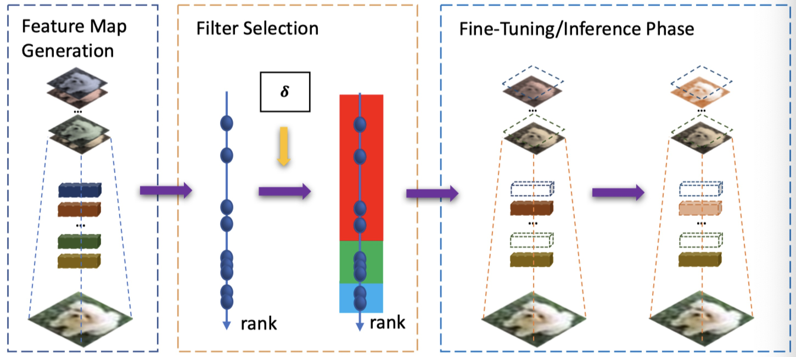

# HRank: Filter Pruning using High-Rank Feature Map ([Link](https://128.84.21.199/abs/2002.10179))!.

Pytorch implementation of HRank.

<div align=center></div>

Framework of HRank. In the left column, we first use images to run through the convolutional layers to get the feature maps. In the middle column, we then estimate the rank of each feature map, which is used as the criteria for pruning. The right column shows the pruning (the red filters), and fine-tuning where the green filters are updated and the blue filters are frozen.

### Experimentation

Firstly, we trained VGG-16 network in GPU and compressed the model upto 21%, 30% and 45% to evaluate the performance with respect to inference time speed up and accuracy on test data. Also, the count of network parameters (such as weights and biases) are included in observation. Furthermore, the latter compressed VGG-16 models are deployed into embedded GPU processor (NVIDIA Xavier GPU) for inference. This deployment provided insights on the significance of neural network compression in terms of inference time however, with compromise in model accuracy.

## Running Code

In this code, you can run our models on CIFAR-100 and ImageNet dataset. The code has been tested by Python 3.7, Pytorch 1.2 and CUDA 10.02 on Ubuntu 18.

#### Model Training

```shell
python main.py \
--job_dir ./result/vgg_16_bn/[folder name] \
--resume [pre-trained model dir] \
--arch vgg_16_bn \
--compress_rate [0.95]+[0.5]*6+[0.9]*4+[0.8]*2 \
--gpu [gpu_id]
```

After training, checkpoints and loggers can be found in the `job_dir`. The pruned model will be named `[arch]_cov[i]` for stage i, and therefore the final pruned model is the one with largest `i`.

#### Get FLOPS & Params
```shell
python cal_flops_params.py \
--arch resnet_56_convwise \
--compress_rate [0.1]+[0.60]*35+[0.0]*2+[0.6]*6+[0.4]*3+[0.1]+[0.4]+[0.1]+[0.4]+[0.1]+[0.4]+[0.1]+[0.4]
```

#### Generate filter rank

```shell
python rank_generation.py \
--resume [pre-trained model dir] \
--arch [model arch name] \
--limit [batch numbers] \
--gpu [gpu_id]

```

#### Evaluate Final Performance
```shell
python evaluate.py \
--dataset [dataset name] \
--data_dir [dataset dir] \
--test_model_dir [job dir of test model] \
--arch [arch name] \
--gpu [gpu id]
```

## Observations

Baseline performance of VGG-16 on GeForce GTX 1080 (Local GPU machine)

|Compression Rate (%)|Inference Time(s)|Speed Up|    Params    | Flops    | Accuracy (Top-1) | Accuracy (Top-5)|
|--------------------|-----------------|--------|--------------|----------|------------------|-----------------|
| No compression     | 0.115           | -      | 15.82M       | 1257.2M  | 71.27%           | 90.63%          |
| 21                 | 0.084           | 1.3x   | 3.59M        | 524.7M   | 72.09%           | 91.53%          |
| 30                 | 0.089           | 1.29x  | 3.33M        | 419.1M   | 71.98%           | 91.43%          |
| 45                 | 0.044           | 2.6x   | 2.73M        | 267.8M   | 70.8%            | 91.36%          |

Performance of VGG-16 on NVIDIA Xavier Processor (Embedded GPU processor)

|Compression Rate (%)|Inference Time(s)|Speed Up|    Params    | Flops    | Accuracy (Top-1) | Accuracy (Top-5)|
|--------------------|-----------------|--------|--------------|----------|------------------|-----------------|
| No compression     | 0.839           | -      | 15.82M       | 1257.2M  | 71.27%           | 90.63%          |
| 21                 | 0.916           | -      | 3.59M        | 524.7M   | 72.09%           | 91.53%          |
| 30                 | 0.762           | 1.1x   | 3.33M        | 419.1M   | 71.98%           | 91.43%          |
| 45                 | 0.574           | 1.5x   | 2.73M        | 267.8M   | 70.8%            | 91.36%          |

## Other optional arguments
```
optional arguments:
    --data_dir			dataset directory
    				default='./data'
    --dataset			dataset name
    				default: cifar10
    				Optional: cifar10', imagenet
    --lr			initial learning rate
    				default: 0.01
    --lr_decay_step		learning rate decay step
				default: 5,10
    --resume			load the model from the specified checkpoint
    --resume_mask		mask loading directory
    --gpu			Select gpu to use
    				default: 0
    --job_dir			The directory where the summaries will be stored.
    --epochs			The num of epochs to train.
    				default: 30
    --train_batch_size		Batch size for training.
    				default: 128
    --eval_batch_size		Batch size for validation. 
				default: 100
    --start_cov			The num of conv to start prune
    				default: 0
    --compress_rate 		compress rate of each conv
    --arch			The architecture to prune
    				default: vgg_16_bn
				Optional: resnet_50, vgg_16_bn, resnet_56, resnet_110, densenet_40, googlenet
```

## Citation


```
@inproceedings{lin2020hrank,
  title={HRank: Filter Pruning using High-Rank Feature Map},
  author={Lin, Mingbao and Ji, Rongrong and Wang, Yan and Zhang, Yichen and Zhang, Baochang and Tian, Yonghong and Shao, Ling},
  booktitle={Proceedings of the IEEE/CVF Conference on Computer Vision and Pattern Recognition (CVPR)},
  pages={1529--1538},
  year={2020}
}
```

## Github Link
Here's the PyTorch implementation of H-Rank compression by the authors - https://github.com/lmbxmu/HRank
